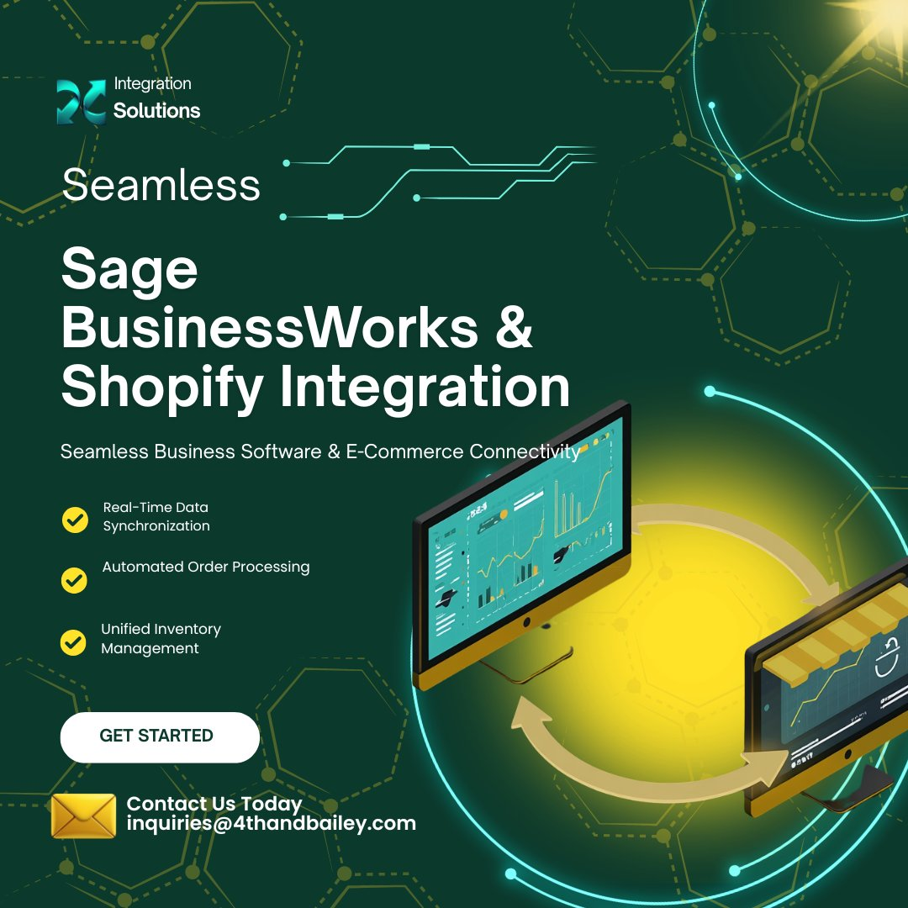

<div align="center">



# Shopify ↔ Sage BusinessWorks Middleware Agent

**Automatically synchronise orders, inventory, fulfillments, customers, and pricing between Shopify and Sage BusinessWorks — no manual data entry required.**

[](LICENSE)
[](https://nodejs.org)
[](https://www.microsoft.com/windows)
[](https://shopify.dev/docs/api/admin-graphql)
[](https://github.com/4thandBailey/shopify-bw-agent/releases)

[**Get Started**](#installation) · [**Data Flows**](#data-flows) · [**Documentation**](#project-structure) · [**Support**](mailto:inquiries@4thandbailey.com)

---

*Built by [4th and Bailey](https://4thandbailey.com) — Enterprise IT Consulting · Houston, TX · Serving Organizations Nationwide*

</div>

---

## Overview

The **Shopify Sage BusinessWorks Integration Agent** is an open-source Windows Service middleware that bridges the gap between Shopify's cloud-native e-commerce platform and Sage BusinessWorks, a powerful on-premises accounting and ERP solution.

Sage BusinessWorks has no REST API and no native cloud connectivity. This agent solves that — running silently in the background on your Windows server, automatically syncing critical business data in both directions using **BWGACCESS** (Sage's official third-party data access SDK) and **32-bit ODBC** for read queries.

### Why This Exists

Most Shopify ↔ Sage integrations assume a cloud ERP. Sage BusinessWorks is different — it is a Windows-native, on-premises application with its own data file structure. This agent was purpose-built to solve that challenge without requiring manual CSV exports, double data entry, or expensive proprietary middleware subscriptions.

### Key Features

- ✅ **Runs as a Windows Service** — starts automatically on boot, manageable via `services.msc` or `sc` commands
- ✅ **Automatic restart** — recovers from failures with configurable retry policy and exponential back-off
- ✅ **Real-time order sync** — Shopify webhooks trigger immediate order import into BusinessWorks
- ✅ **Bidirectional sync** — data flows in both directions across all five key data domains
- ✅ **Change detection** — inventory and pricing only update when values actually change, minimising API calls
- ✅ **Graceful shutdown** — waits for in-progress sync flows to complete before stopping
- ✅ **Persistent state** — sync cursors survive service restarts via JSON state files
- ✅ **Structured logging** — daily rotating log files with configurable retention
- ✅ **No SaaS subscription** — fully open source, self-hosted, no per-seat fees

---

## Architecture Overview

```
┌─────────────────────┐         ┌─────────────────────────────┐        ┌──────────────────────┐
│    Shopify Store    │◄───────►│  Middleware Agent (Windows) │◄──────►│  Sage BusinessWorks  │
│                     │Webhooks │  Node.js Windows Service    │BWGACCESS│  (Local / Network)  │
│  GraphQL Admin API  │+ Polling│  Runs on BW server          │  +ODBC  │  Database Files      │
└─────────────────────┘         └─────────────────────────────┘        └──────────────────────┘
```

### Data Flows

| Direction | Data | Trigger | Method |
|---|---|---|---|
| Shopify → BusinessWorks | New / updated orders | Webhook + 5-min poll | BWGACCESS CSV import |
| BusinessWorks → Shopify | Shipped order tracking & fulfillment | 5-min poll | ODBC read + GraphQL |
| BusinessWorks → Shopify | Inventory levels | 10-min poll | ODBC read + GraphQL |
| BusinessWorks → Shopify | Customer records | Hourly poll | ODBC read + GraphQL |
| BusinessWorks → Shopify | Product pricing | 30-min poll | ODBC read + GraphQL |

---

## Prerequisites

| Requirement | Notes |
|---|---|
| **Windows Server 2016+** or Windows 10/11 | Must be on same machine or network as BusinessWorks |
| **Node.js 18+** (64-bit) | Download from [nodejs.org](https://nodejs.org) |
| **Sage BusinessWorks** | Any recent version |
| **BWGACCESS SDK** | Obtained from Sage — email `[email protected]` |
| **ODBC DSN (32-bit)** | Configured in Windows ODBC Data Source Administrator (32-bit) |
| **Shopify Custom App** | Scopes: `read_orders`, `write_fulfillments`, `read_products`, `write_inventory`, `read_customers`, `write_customers` |

---

## Installation

### 1. Clone or Copy the Project

Place the project folder on the Windows machine that runs Sage BusinessWorks:

```cmd
git clone https://github.com/4thandBailey/shopify-bw-agent.git C:\ShopifyBWAgent
cd C:\ShopifyBWAgent
```

### 2. Install Node Dependencies

Open a Command Prompt **as Administrator**:

```cmd
cd C:\ShopifyBWAgent
npm install
```

### 3. Configure the Agent

Copy `.env.example` to `.env` and fill in all values:

```cmd
copy .env.example .env
notepad .env
```

Key settings:

```env
# Shopify
SHOPIFY_STORE_URL=https://your-store.myshopify.com
SHOPIFY_ACCESS_TOKEN=shpat_...

# Sage BusinessWorks ODBC (32-bit DSN name)
BW_ODBC_DSN=SageBusinessWorks

# BWGACCESS paths
BWGACCESS_EXE_PATH=C:\SageBusinessWorks\BWGACCESS\BWGACCESS.exe
BWGACCESS_IMPORT_DIR=C:\SageBusinessWorks\imports
BWGACCESS_EXPORT_DIR=C:\SageBusinessWorks\exports
BWGACCESS_COMPANY_DIR=C:\SageBusinessWorks\Company
```

### 4. Configure the ODBC DSN

1. Open **ODBC Data Source Administrator (32-bit)**: `C:\Windows\SysWOW64\odbcad32.exe`
2. Add a **System DSN** pointing to your Sage BusinessWorks database
3. The DSN name must match `BW_ODBC_DSN` in your `.env`

### 5. Verify BusinessWorks Table Names

Sage BusinessWorks table names vary slightly by version. Open `src/services/businessworks.js` and confirm the SQL queries match your ODBC schema:

| Table | Module | Contents |
|---|---|---|
| `IC_ITEM` | Inventory Control | Item master — qty on hand, pricing |
| `OE_ORDER_HEADER` | Order Entry | Order headers, ship dates, tracking |
| `AR_CUSTOMER` | Accounts Receivable | Customer master records |
| `IC_PRICE_LEVEL` | Inventory Control | Price levels per item |

> **Tip:** Use Excel's built-in ODBC connection or Microsoft Access linked tables to browse your BusinessWorks schema and confirm table names.

### 6. Add the SHOPIFY_ORDER Field to BusinessWorks

The fulfillment sync stores the Shopify Order ID in a custom field `SHOPIFY_ORDER` on `OE_ORDER_HEADER`. Work with your BusinessWorks consultant to add this field, or configure the agent to use an existing reference/comment field.

---

## Running as a Windows Service

### Install the Service

Run as **Administrator**:

```cmd
cd C:\ShopifyBWAgent
node scripts/install-service.js
```

This registers **ShopifyBWAgent** in Windows Services, sets it to start automatically on boot, configures automatic restart on failure, and starts the service immediately.

### Manage the Service

**Via Windows Service Manager (GUI):**
1. Press `Win + R`, type `services.msc`, press Enter
2. Find **ShopifyBWAgent** in the list
3. Right-click → Start / Stop / Restart / Properties

**Via Command Line:**
```cmd
sc start  ShopifyBWAgent    # Start the service
sc stop   ShopifyBWAgent    # Stop the service
sc query  ShopifyBWAgent    # Check status
```

### Uninstall the Service

```cmd
node scripts/uninstall-service.js
```

---

## Running in Development Mode

Test the agent locally without installing it as a Windows Service:

```cmd
npm run dev
```

Development mode skips the initial startup sync, logs to the console with colour output, and runs the webhook server on localhost only.

---

## Shopify Webhook Configuration

Register these webhooks in your Shopify Partner Dashboard or via the Admin API for real-time order triggering:

| Topic | Endpoint |
|---|---|
| `orders/create` | `https://YOUR-SERVER:3456/webhooks/orders/create` |
| `orders/updated` | `https://YOUR-SERVER:3456/webhooks/orders/updated` |

> Shopify requires HTTPS for webhooks. Place a reverse proxy (nginx, IIS, Caddy) in front of the agent for production deployments.

---

## Log Files

| File | Contents |
|---|---|
| `shopify-bw-agent-YYYY-MM-DD.log` | All log levels (info, warn, error, debug) |
| `shopify-bw-agent-error-YYYY-MM-DD.log` | Errors only |
| `state/*.json` | Sync state — last run timestamps, processed order IDs |

Logs rotate daily, are compressed, and are deleted after `LOG_RETENTION_DAYS` (default: 30 days).

---

## Troubleshooting

| Problem | Solution |
|---|---|
| ODBC connection fails | Verify DSN name in 32-bit ODBC Admin (`odbcad32.exe`); confirm BusinessWorks is running |
| BWGACCESS fails | Confirm executable path in `.env`; run BWGACCESS manually to verify license |
| Shopify 401 Unauthorized | Regenerate access token in Shopify Partner Dashboard; verify app scopes |
| Orders not importing into BW | Review BW Order Entry CSV import spec; check `ordersToBusinessWorks` logs |
| Service won't start | Open Windows Event Viewer → Windows Logs → Application for error details |
| Inventory not updating | Confirm Shopify SKU values match BW `ITEM_CODE` exactly (case-insensitive) |
| Fulfillments not syncing | Verify `SHOPIFY_ORDER` field exists on `OE_ORDER_HEADER`; check order STATUS = 'S' |

---

## Project Structure

```
shopify-bw-agent/
├── src/
│   ├── agent.js                     # Main entry point, cron scheduler, graceful shutdown
│   ├── config/
│   │   └── index.js                 # Environment config loader with validation
│   ├── services/
│   │   ├── shopify.js               # Shopify GraphQL Admin API client
│   │   ├── businessworks.js         # Sage BusinessWorks ODBC + BWGACCESS client
│   │   └── webhookServer.js         # Express webhook HTTP server
│   ├── flows/
│   │   ├── ordersToBusinessWorks.js # Shopify unfulfilled orders → BW Order Entry
│   │   ├── fulfillmentsToShopify.js # BW shipped orders → Shopify fulfillments
│   │   ├── inventoryToShopify.js    # BW inventory levels → Shopify stock
│   │   ├── customersToShopify.js    # BW AR customers → Shopify customers
│   │   └── pricingToShopify.js      # BW item pricing → Shopify variant prices
│   └── utils/
│       ├── logger.js                # Winston rotating file logger
│       └── stateStore.js           # Persistent JSON sync-cursor state store
├── scripts/
│   ├── install-service.js           # Register as Windows Service (run as Admin)
│   └── uninstall-service.js         # Remove Windows Service
├── logs/                            # Runtime logs (git-ignored)
├── CHANGELOG.md                     # Version history
├── METHODOLOGY.md                   # Architecture decisions and design rationale
├── SECURITY.md                      # Security policy and vulnerability disclosure
├── .env.example                     # Fully documented configuration template
├── package.json
└── README.md
```

---

## Documentation

| Document | Description |
|---|---|
| [CHANGELOG.md](CHANGELOG.md) | Full version history following Keep a Changelog format |
| [METHODOLOGY.md](METHODOLOGY.md) | Architecture decisions, integration pathway rationale, design tradeoffs |
| [SECURITY.md](SECURITY.md) | Security model, credential handling, vulnerability disclosure process |

---

## Implementation Services

This agent is open source and free to use. If you need professional implementation, customisation, or ongoing support, [4th and Bailey](https://4thandbailey.com) provides enterprise IT consulting services nationwide.

📧 [inquiries@4thandbailey.com](mailto:inquiries@4thandbailey.com)
📞 (888) 305-5977
🌐 [4thandbailey.com](https://4thandbailey.com)
💼 [LinkedIn](https://linkedin.com/company/4thandbailey)

---

## Related Projects

| Project | Description |
|---|---|
| [Infrastructure Placement Framework](https://github.com/4thandBailey/infrastructure-placement-framework) | Vendor-neutral framework for cloud, on-premises, hybrid, and AI infrastructure decisions |
| [Microsoft 365 PowerShell Tools](https://github.com/4thandBailey/tools) | Free M365 admin scripts — MFA reporting, inactive users, license optimization |

---

## License

MIT License — free to use, modify, and distribute. See [LICENSE](LICENSE) for details.

---

<div align="center">

**Built with ❤️ in Houston, TX by [4th and Bailey](https://4thandbailey.com)**

*Boutique firm. Enterprise standards. Principal-led on every engagement.*

[Website](https://4thandbailey.com) · [GitHub](https://github.com/4thandBailey) · [LinkedIn](https://linkedin.com/company/4thandbailey) · [(888) 305-5977](tel:8883055977)

</div>
